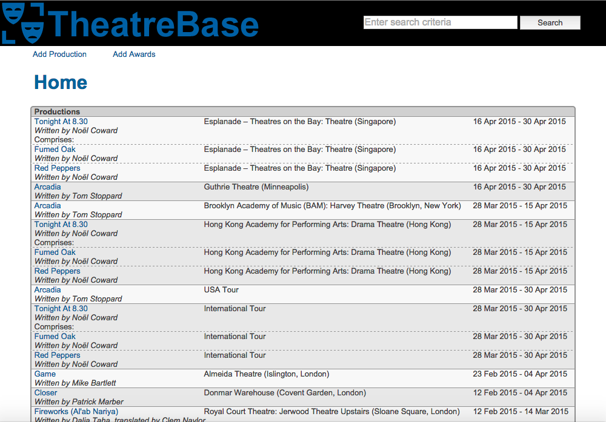
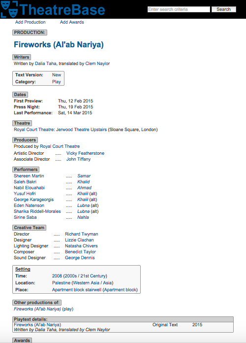
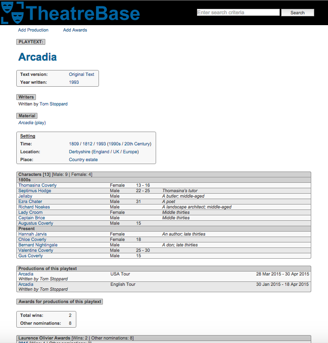
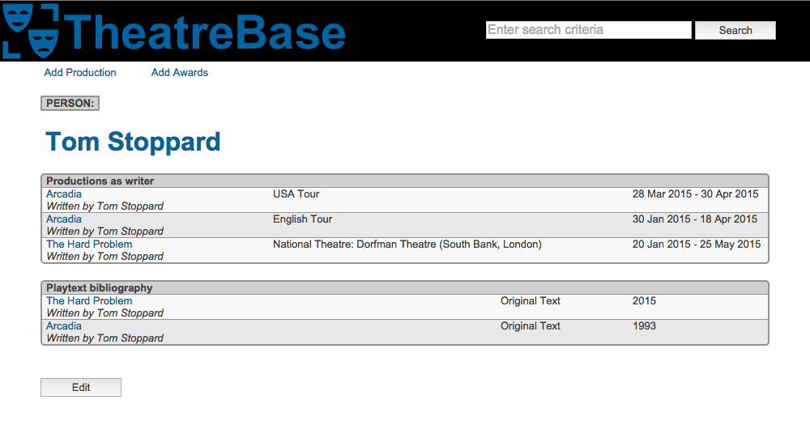
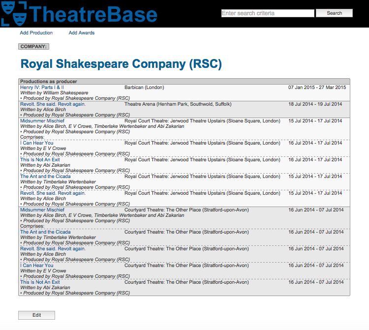
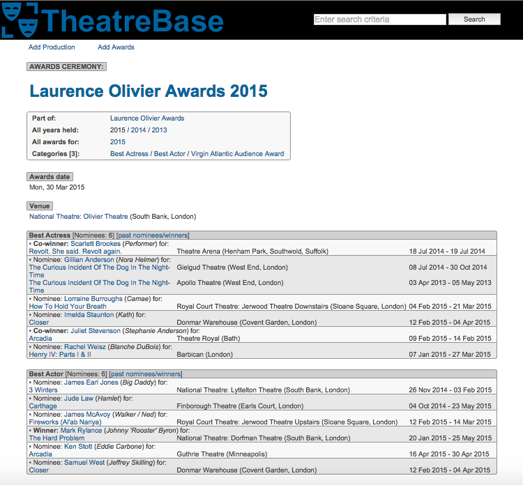
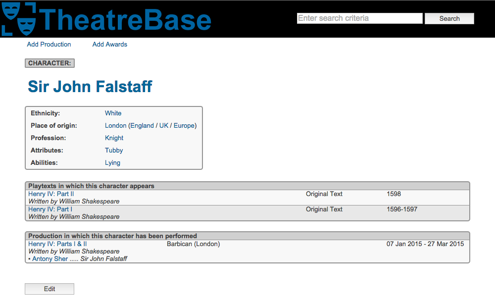
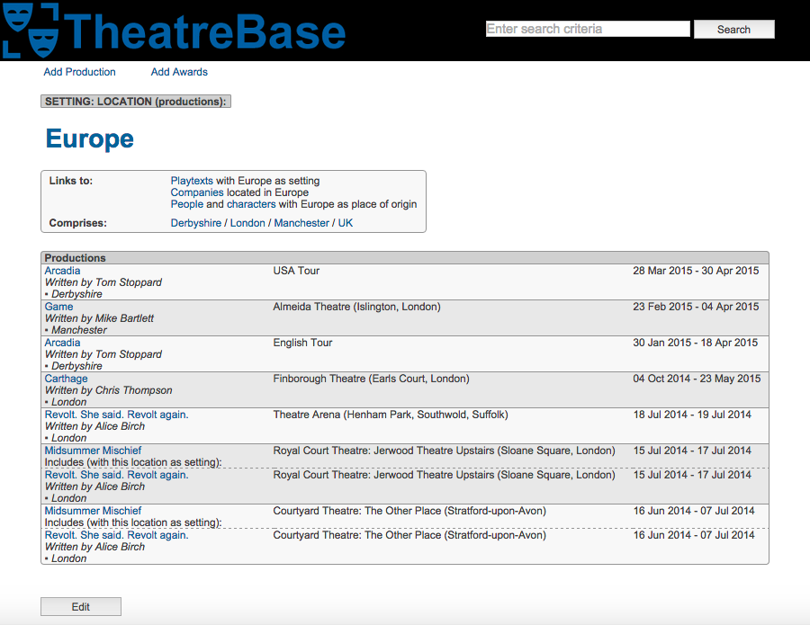

TheatreBase
=================


Brief:
-------

A database-driven site that provides listings for theatrical productions, playtexts and associated data.

*The site has not been built using best practices (i.e. no testing; methods not fully utilised; no use of MVC; not object-oriented) and will be rebuilt using a Ruby on Rails framework, but serves as a template for how the site should behave.*


Site overview:
-------

#### Productions
- Title
- Material (i.e. The Seagull (play))
- Playtext (i.e. The Seagull (2012))
- Dates (preview / press night / booking until / final performance)
- Theatre
- Class (professional / amateur / drama school)
- Touring (legs / overview)
- Collections (segments / overview)
- Plays in repertory with
- Previous/subsequent runs
- Production version (world premiere; return; West End transfer, etc.)
- Text version (new; revival; new adaptation; abridged text, etc.)
- Category (play; musical; monologue; opera; ballet, etc.)
- Genre (Shakespearean tragedy; Ancient Greek; farce; Restoration comedy; In-yer-face theatre, etc.)
- Features (all male cast (if unconventional); modernised setting; site specific; Spanish language, etc.)
- Themes (global warming; regicide; insomnia, etc.)
- Setting: time, location & place (Easter 1962, bedsit, Knightsbridge)
- Writers (company & people, inc. source material)
- Producers (company & people)
- Performers (company & people) and corresponding characters portrayed
- Understudies (company & people) and corresponding characters portrayed
- Musicians(company & people)
- Creative team (company & people)
- Production team (company & people)
- Season (i.e. David Hare season (Sheffield Theatres))
- Festival (i.e. RSC Complete Works Festival)
- Course (i.e. Royal Academy of Dramatic Art (RADA): 3 Year Acting (2006-09))
- Reviews (critic, publication and URL link to online review)
- Awards

#### Playtexts
- Title
- Material (i.e. The Seagull (play))
- Text version (i.e. original text; new translation; abridged text, etc.)
- Year written
- Collections (segments / overview / collected works)
- Writers (company & people, inc. source material)
- Contributors (company & people) (in relation to publication of text)
- Category (play; musical; monologue, etc.)
- Genre (Shakespearean tragedy; Ancient Greek; farce; Restoration comedy; In-yer-face theatre, etc.)
- Features (modernised setting; site specific; Spanish language, etc.)
- Themes (global warming; regicide; insomnia, etc.)
- Setting: time, location & place (Easter 1962, bedsit, Knightsbridge)
- Cast required
- Characters
- Licensors
- Productions of the playtext listings
- Awards (for the playtext and productions of the playtext)

#### Theatre
- Name
- Building location
- Type (West End; fringe; regional; studio, etc.)
- Theatre owners
- Subtheatres (i.e. National Theatre: Olivier Theatre / Royal Court Theatre: Jerwood Theatre Downstairs, etc.)
- Capacity
- Opening/closing dates
- Production listings

#### Awards
- Award grantor (i.e. Laurence Olivier Awards)
- Award ceremony (i.e. grantor and year: Laurence Olivier Awards 2015)
- Award categories (specifically within ceremony and history of a given award category)
- Category nominees: productions; playtexts; companies; people
- Ceremony venue and date

#### Company
- Name (trading and registered)
- Base location
- Company type (i.e. subsidised theatre; commercial theatre; literary agency)
- Company members and corresponding roles
- Production and playtext listings (in various roles)
- Awards
- Clients represented (as agency)
- Drama school courses coordinated
- Theatre owned

#### People
- Name
- Sex
- Ethnicity
- Place of origin
- Profession within the industry
- Production and playtext listings (in various roles)
- Awards
- Representation (agency and agent) / Clients represented (as agent)
- Drama school courses coordinated / as staff / as student

#### Character
- Name
- Sex
- Age / range
- Description
- Ethnicity
- Place of origin
- Profession
- Attributes (physical and characteristics)
- Abilities
- Playtexts in which character appears
- Productions in which character has been portrayed

#### Drama school course
- Course type (3 Year Acting; 2 Year Directing, etc.)
- Course start/end dates
- Course coordinators (company & people)
- Course staff
- Students
- Production listings

#### Season
- Name
- Production listings

#### Festival
- Name
- Production listings

#### Material
- Name
- Format (play; operetta; musical; novel; screenplay, etc.; encompasses material when used as source material)
- Production and playtext listings

#### Production version
- Description
- Production and playtext listings

#### Text version
- Description
- Production and playtext listings

#### Category
- Description
- Production and playtext listings

#### Genre
- Description
- Related genres (i.e. Shakespearean history -> Shakespearean theatre, Elizabethan theatre)
- Production and playtext listings

#### Feature
- Description
- Production and playtext listings

#### Theme
- Description
- Broader themes (i.e. Normandy landings -> World War II, World War, War)
- Production and playtext listings

#### Setting: Location
- Name
- Related locations (i.e. Derbyshire -> England, UK, Europe)
- Sunsequently/previously (i.e. Constantinople subsequently Istanbul)
- Production and playtext listings
- Person and character listings (originated from location)
- Theatre and company listings (based at location)

#### Setting: Place
- Name
- Related places (i.e. Airport cafe -> Airport, Cafe)
- Production and playtext listings

#### Setting: Time
- Description
- Date(s)
- Related times (i.e. 1993 -> 1990s, 20th Century)
- Production and playtext listings

#### Ethnicity
- Description
- Related ethnicities (i.e. Rutul -> Russian; Han -> Chinese; Yoruba -> African)
- Person and character listings

#### Profession
- Description
- Related professions (i.e. King of England -> King, Royalty; Literary agent -> Agent)
- Person and character listings

#### Attributes
- Description
- Related attributes (i.e. Pentecostal -> Protestant Christian, Christian)
- Character listings

#### Abilities
- Description
- Character listings


Technologies used:
-------

- PHP
- SQL with MySQL database
- HTML
- CSS3


Site setup (for Mac OS X)
-------

#### Instructions taken from [Build Your Own Database Driven Web Site Using PHP & MySQL by Kevin Yank (Sitepoint)](http://www.sitepoint.com/php-amp-mysql-1-installation/)

#### Installing MySQL

- Visit the [MySQL Downloads page](https://dev.mysql.com/downloads/)
- Visit [page of download links](http://dev.mysql.com/downloads/mysql/)
- Download file (Mac OS X 10.5 (x86) is a safe bet (although seemingly deprecated)) and go through MySQL installation process
- Launch MySQL server via terminal: `$ sudo /usr/local/mysql/bin/mysqld_safe`; then `Ctrl + Z` (stops process); then `$ bg` (to run in background)
- To shut down MySQL server: `$ sudo /usr/local/mysql/bin/mysqladmin shutdown` OR install file `MySQL.prefPane` (received with installation files) to install new pane in System Preferences (start/shut server via button click)
- Install `MySQLStartupItem.pkg` (to launch MySQL server automatically on system restart)
- Delete the `MySQL installation disk icon` and `.dmg` file
- Following commands to run `mysqladmin` and `mysql` in terminal without having to type full paths: `$ sudo su`; then password; then `$ echo '/usr/local/mysql/bin' >> /etc/paths.d/mysql`; then `$ exit`
- Close terminal window; reopen (to effect change); then with MySQL server running type: `$ mysqladmin status`; success confirmed with display of MySQL server stats list

#### Installing PHP

- Open **System Preferences**; click **Sharing** (under **Internet & Network**); ensure **Web Sharing** is checked; quit System Preferences; visit `http://localhost` (should display Apache welcome message)
- In Finder menu bar, choose **Go > Go to folder (⇧+⌘+G)**; type `/private/etc/apache2`; click **Go**
- Right click Apache configuration file **httpd.conf** and choose **Get Info (⌘+I)**; scroll to bottom of **httpd.conf Info** window to find **Sharing and Permissions** setting; click padlock icon to enable settings (enter password when prompted)
- To make file editable, change **Privilege** for **everyone** to **Read & Write**
- In Finder window for **apache2** folder, right-click in background and choose **Get Info**; set **Sharing & Permissions** for **everyone** to **Read & Write**
- Open `httpd.conf` file in a text editor and enable below two lines by deleting leading hash (#):
```
#LoadModule php5_module libexec/apache2/libphp5.so
#LoadModule rewrite_module libexec/apache2/mod_rewrite.so
```
- Save changes to file and quit; reset privileges in **httpd.conf** file and **apache2** folder
- Enter in terminal to restart Apache: `$ sudo /usr/sbin/apachectl restart`; type password when prompted
- Visit `http://localhost` to ensure Apache is still running
- Edit PHP configuration file **php.ini** (to tell PHP how to connect to MySQL server); no default file in Mac OS X, so in terminal: `$ cd /private/etc`; then `$ sudo cp php.ini.default php.ini`; enter password when prompted
- To make **php.ini** file editable, in Finder use **Go > Go to folder** to open **/private/etc** to modify the **php.ini** file and its parent folder
- Open php.ini file with text editor and amend `mysql.default_socket` and `mysqli.default_socket` options to read:
```
mysql.default_socket = /tmp/mysql.sock
mysqli.default_socket = /tmp/mysql.sock
```
- Save changes to file and quit; reset privileges in **php.ini** file and parent folder
- Open terminal and type following to restart Apache once more: `$ sudo /usr/sbin/apachectl restart`; type password when prompted
- Visit `http://localhost` to ensure all well

#### Post-Installation

- In terminal enter following to view basic MySQL server stats: `$ mysqladmin -u root status`
- Set a root password for MySQL: `$ mysqladmin -u root -p password "newpassword"`
- Click **Enter** when prompted to enter current root MySQL user
- Check password security created: `$ mysqladmin -u root -p status`; enter new password when prompted (now required and entry made possible with `-p` switch)

#### Access MySQL

- In terminal enter: `$ mysql -u root -p`; enter password when prompted

#### Create database

- Copy and paste [database schema](https://github.com/andygout/theatrebase_php/blob/master/includes/misc/mysql_db_schema.txt) into mysql to create requisite tables


Next steps:
-------

Listed [here](https://github.com/andygout/theatrebase_php/blob/master/includes/misc/to_do.md)


Screenshots:
-------

#### Home page


#### Production


#### Playtext


#### Person


#### Company


#### Awards


#### Character


#### Setting (location)
